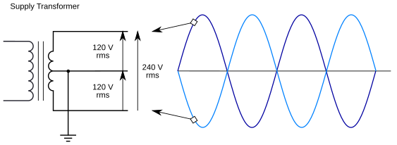
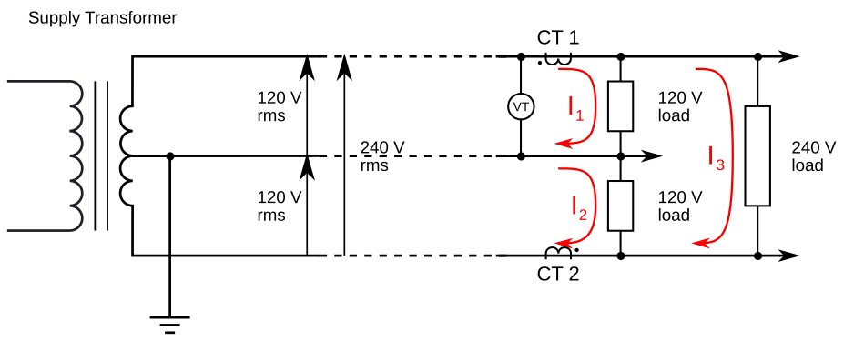
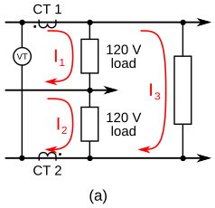
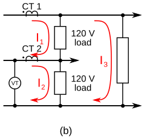
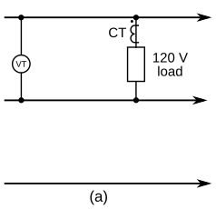
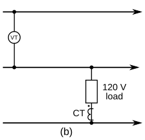
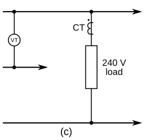
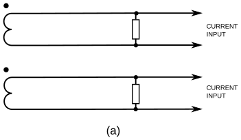
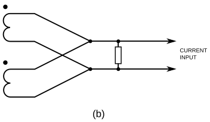
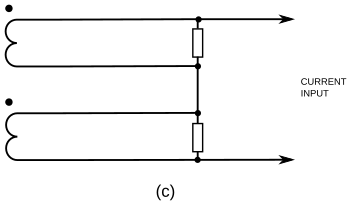

# Use in North America

In order to understand how these units can be used in North America, it might be helpful to give a
brief outline of the UK power system and the differences from UK practice.
<svg>
<svg xmlns:dc="http://purl.org/dc/elements/1.1/" xmlns:cc="http://creativecommons.org/ns#" xmlns:rdf="http://www.w3.org/1999/02/22-rdf-syntax-ns#" xmlns:svg="http://www.w3.org/2000/svg" xmlns="http://www.w3.org/2000/svg" xmlns:sodipodi="http://sodipodi.sourceforge.net/DTD/sodipodi-0.dtd" xmlns:inkscape="http://www.inkscape.org/namespaces/inkscape" version="1.1" onload="Start(evt)" width="550" height="250" id="svg2" inkscape:version="0.48.2 r9819" sodipodi:docname="Phasors.svg">
  <metadata id="metadata33">
    <rdf:RDF>
      <cc:Work rdf:about="">
        <dc:format>image/svg+xml</dc:format>
        <dc:type rdf:resource="http://purl.org/dc/dcmitype/StillImage"/>
      </cc:Work>
    </rdf:RDF>
  </metadata>
  <sodipodi:namedview pagecolor="#ffffff" bordercolor="#666666" borderopacity="1" objecttolerance="10" gridtolerance="10" guidetolerance="10" inkscape:pageopacity="0" inkscape:pageshadow="2" inkscape:window-width="1022" inkscape:window-height="712" id="namedview31" showgrid="true" showguides="true" inkscape:guide-bbox="true" inkscape:zoom="1.1813271" inkscape:cx="287.17399" inkscape:cy="107.32771" inkscape:window-x="-2" inkscape:window-y="-4" inkscape:window-maximized="1" inkscape:current-layer="svg2" inkscape:snap-grids="true">
    <sodipodi:guide orientation="0,1" position="202.73642,125.03953" id="guide3010"/>
    <sodipodi:guide orientation="1,0" position="469.93083,59.868587" id="guide3012"/>
    <inkscape:grid type="xygrid" id="grid3017" empspacing="5" visible="true" enabled="true" snapvisiblegridlinesonly="true"/>
  </sodipodi:namedview>
  <script type="text/ecmascript" id="script4">

    var time = 0;
    var delta_time = 0.25;
    var max_time = 720.0;
    var dir = 1;

    var phasor;

    function Start(evt) {

      phasor = evt.target.ownerDocument.getElementById("Phasors");
	  cursor = evt.target.ownerDocument.getElementById("Cursor");
      Rotate();
    }

    function Rotate() {

      time = time + delta_time;
      if (time &gt;  max_time)  time = 0;
	
      angle = (time * 720.0) / max_time;
	  x_pos = (time * 250.0) / max_time;
	  phasor.setAttribute("transform", "rotate(" + (-angle) + " 100 125)");
	  cursor.setAttribute("transform",  "translate(" +x_pos+ ", 0.0 )");

      // Repeat
      setTimeout("Rotate()", delta_time)
    }

    window.Rotate = Rotate

   </script>
  <defs id="defs5769">
    <marker refX="0" refY="0" orient="auto" id="Arrow1Mend" style="overflow:visible">
      <path d="M 0,0 5,-5 -12.5,0 5,5 0,0 z" transform="matrix(-0.4,0,0,-0.4,-4,0)" id="path4582" style="fill-rule:evenodd;stroke:#000000;stroke-width:1pt;marker-start:none"/>
    </marker>
    <marker refX="0" refY="0" orient="auto" id="Arrow1Lend" style="overflow:visible">
      <path d="M 0,0 5,-5 -12.5,0 5,5 0,0 z" transform="matrix(-0.8,0,0,-0.8,-10,0)" id="path4576" style="fill-rule:evenodd;stroke:#000000;stroke-width:1pt;marker-start:none"/>
    </marker>
    <marker refX="0" refY="0" orient="auto" id="Arrow1Mend-6" style="overflow:visible">
      <path d="M 0,0 5,-5 -12.5,0 5,5 0,0 z" transform="matrix(-0.4,0,0,-0.4,-4,0)" id="path4582-6" style="fill-rule:evenodd;stroke:#000000;stroke-width:1pt;marker-start:none"/>
    </marker>
    <marker refX="0" refY="0" orient="auto" id="Arrow1Mend-8" style="overflow:visible">
      <path d="M 0,0 5,-5 -12.5,0 5,5 0,0 z" transform="matrix(-0.4,0,0,-0.4,-4,0)" id="path4582-4" style="fill-rule:evenodd;stroke:#000000;stroke-width:1pt;marker-start:none"/>
    </marker>
    <marker refX="0" refY="0" orient="auto" id="Arrow1MendU" style="overflow:visible">
      <path d="M 0,0 5,-5 -12.5,0 5,5 0,0 z" transform="matrix(-0.4,0,0,-0.4,-4,0)" id="path6709" style="fill:#ffb100;fill-rule:evenodd;stroke:#ffb100;stroke-width:2pt;marker-start:none"/>
    </marker>
    <marker refX="0" refY="0" orient="auto" id="Arrow1MendC" style="overflow:visible">
      <path d="M 0,0 5,-5 -12.5,0 5,5 0,0 z" transform="matrix(-0.4,0,0,-0.4,-4,0)" id="path6756" style="fill:#0000ff;fill-rule:evenodd;stroke:#0000ff;stroke-width:2pt;marker-start:none"/>
    </marker>
    <marker refX="0" refY="0" orient="auto" id="Arrow1Mend5" style="overflow:visible">
      <path d="M 0,0 5,-5 -12.5,0 5,5 0,0 z" transform="matrix(-0.4,0,0,-0.4,-4,0)" id="path6803" style="fill:#fc0000;fill-rule:evenodd;stroke:#fc0000;stroke-width:2pt;marker-start:none"/>
    </marker>
  </defs>
  <rect style="color:#000000;fill:#ffffff;fill-opacity:1;stroke:none;stroke-width:1.25000000000000000;stroke-linecap:butt;stroke-linejoin:miter;stroke-miterlimit:4;stroke-opacity:1;stroke-dasharray:none;stroke-dashoffset:0;marker:none;visibility:visible;display:inline;overflow:visible;enable-background:accumulate" id="rect3005" width="500" height="250" x="0.56566191" y="1.4101796" ry="0"/>
  <path style="color:#000000;fill:none;stroke:#000000;stroke-width:0.74299997;stroke-linecap:butt;stroke-linejoin:miter;stroke-miterlimit:4;stroke-opacity:1;stroke-dasharray:none;stroke-dashoffset:0;marker:none;visibility:visible;display:inline;overflow:visible;enable-background:accumulate" d="m 9.8502215,125.08945 179.9999985,0" id="path4527-8" inkscape:connector-curvature="0" sodipodi:nodetypes="cc"/>
  <path style="color:#000000;fill:none;stroke:#000000;stroke-width:0.74299997;stroke-linecap:butt;stroke-linejoin:miter;stroke-miterlimit:4;stroke-opacity:1;stroke-dasharray:none;stroke-dashoffset:0;marker:none;visibility:visible;display:inline;overflow:visible;enable-background:accumulate" d="m 99.850222,35.089448 0,180.000002" id="path4527" inkscape:connector-curvature="0" sodipodi:nodetypes="cc"/>
  <g id="Phasors" transform="rotate(-388 100 125)">
    <g transform="translate(0,-812.36218)" id="layer1">
      <path d="m 100,125 75,0" transform="translate(0,812.36218)" id="path5783" style="color:#000000;fill:none;stroke:#ff0000;stroke-width:1.75;stroke-linecap:butt;stroke-linejoin:miter;stroke-miterlimit:4;stroke-opacity:1;stroke-dasharray:none;stroke-dashoffset:0;marker:none;marker-end:url(#Arrow1Mend5);visibility:visible;display:inline;overflow:visible;enable-background:accumulate"/>
      <path d="M 100,937.36218 62.5,872.41028" id="path5783-1" style="color:#000000;fill:none;stroke:#0000ff;stroke-width:1.75;stroke-linecap:butt;stroke-linejoin:miter;stroke-miterlimit:4;stroke-opacity:1;stroke-dasharray:none;stroke-dashoffset:0;marker:none;marker-end:url(#Arrow1MendC);visibility:visible;display:inline;overflow:visible;enable-background:accumulate"/>
      <path d="M 100,937.36218 62.5,1002.3141" id="path5783-9" style="color:#000000;fill:none;stroke:#ffb100;stroke-width:2.00;stroke-linecap:butt;stroke-linejoin:miter;stroke-miterlimit:4;stroke-opacity:1;stroke-dasharray:none;stroke-dashoffset:0;marker:none;marker-end:url(#Arrow1MendU);visibility:visible;display:inline;overflow:visible;enable-background:accumulate"/>
    </g>
  </g>
  <rect style="color:#000000;fill:#7d7d7d;fill-opacity:1;stroke:none;stroke-width:1.75;marker:none;visibility:visible;display:inline;overflow:visible;enable-background:accumulate" id="Cursor" width="3" height="170" x="220" y="35" transform="translate(134.72222222222223, 0.0 )"/>
  <path id="path7362" title="sin(x)" d="m 220,125 c 1.70068,-6.41141 3.40136,-12.82216 5.10204,-19.02409 1.70068,-6.20196 3.40136,-12.19296 5.10204,-17.77975 1.70068,-5.58678 3.40136,-10.76617 5.10204,-15.372371 1.70068,-4.606207 3.40136,-8.635184 5.10204,-11.959516 1.70068,-3.324332 3.40136,-5.93937 5.10204,-7.764382 1.70068,-1.825012 3.40136,-2.85506 5.10204,-3.061377 1.70069,-0.206318 3.40137,0.416 5.10205,1.841873 1.70068,1.425872 3.40136,3.65985 5.10204,6.624645 1.70068,2.964795 3.40136,6.664308 5.10204,10.974098 1.70068,4.309791 3.40136,9.23285 5.10204,14.60573 1.70068,5.37288 3.40136,11.19747 5.10204,17.28202 1.70068,6.08453 3.40136,12.42967 5.10204,18.82785 1.70068,6.39819 3.40136,12.84883 5.10204,19.14217 1.70068,6.29334 3.40136,12.42754 5.10204,18.20438 1.70068,5.77684 3.40136,11.19337 5.10204,16.07585 1.70068,4.88248 3.40136,9.22704 5.10204,12.89579 1.70068,3.66875 3.40136,6.65716 5.10204,8.87221 1.70068,2.21505 3.40136,3.65184 5.10204,4.2683 1.70068,0.61647 3.40137,0.40765 5.10205,-0.6148 1.70068,-1.02245 3.40136,-2.8632 5.10204,-5.45768 1.70068,-2.59448 3.40136,-5.94678 5.10204,-9.94359 1.70068,-3.99681 3.40136,-8.64137 5.10204,-13.77907 1.70068,-5.1377 3.40136,-10.77073 5.10204,-16.71326 1.70068,-5.94254 3.40136,-12.19557 5.10204,-18.55424 1.70068,-6.35867 3.40136,-12.8227 5.10204,-19.18158 1.70068,-6.35888 3.40136,-12.61108 5.10204,-18.55426 1.70068,-5.94315 3.40136,-11.57457 5.10204,-16.71326 1.70068,-5.13869 3.40136,-9.780977 5.10204,-13.779071 1.70068,-3.998094 3.40136,-7.347601 5.10204,-9.943586 1.70068,-2.595985 3.40136,-4.433614 5.10204,-5.457687 1.70068,-1.024072 3.40137,-1.229624 5.10205,-0.614799 1.70068,0.614825 3.40136,2.054795 5.10204,4.268301 1.70068,2.213507 3.40136,5.204811 5.10204,8.872213 1.70068,3.667402 3.40136,8.014377 5.10204,12.895789 1.70068,4.88141 3.40136,10.29972 5.10204,16.07585 1.70068,5.77613 3.40136,11.91138 5.10204,18.2044 1.70068,6.29303 3.40136,12.74387 5.10204,19.14217 1.70068,6.39829 3.40136,12.7428 5.10204,18.82785 1.70068,6.08504 3.40136,11.90822 5.10204,17.282 1.70068,5.37378 3.40136,10.29472 5.10204,14.60573 1.70068,4.31101 3.40136,8.00784 5.10204,10.9741 1.70068,2.96625 3.40136,5.19717 5.10204,6.62464 1.70068,1.42748 3.40136,2.04655 5.10205,1.84188 1.70068,-0.20468 3.40136,-1.23795 5.10204,-3.06138 1.70068,-1.82344 3.40136,-4.44146 5.10204,-7.76438 1.70068,-3.32293 3.40136,-7.35446 5.10204,-11.95952 1.70068,-4.60506 3.40136,-9.78639 5.10204,-15.37237 1.70068,-5.58598 3.57825,-12.24092 5.27893,-18.44244 l 4.85598,-18.40091" style="color:#000000;fill:none;stroke:#ff0000;stroke-width:1.75;stroke-linecap:butt;stroke-linejoin:miter;stroke-miterlimit:4;stroke-opacity:1;stroke-dasharray:none;stroke-dashoffset:0;marker:none;visibility:visible;display:inline;overflow:visible;enable-background:accumulate" inkscape:connector-curvature="0" sodipodi:nodetypes="cssssssssssssssssssssssssssssssssssssssssssssssscc"/>
  <path style="color:#000000;fill:none;stroke:#0000ff;stroke-width:1.75;stroke-linecap:butt;stroke-linejoin:miter;stroke-miterlimit:4;stroke-opacity:1;stroke-dasharray:none;stroke-dashoffset:0;marker:none;visibility:visible;display:inline;overflow:visible;enable-background:accumulate" d="m 220,60.9195 c 1.70068,3.332108 3.40136,7.369395 5.10204,11.980782 1.70068,4.611388 3.40136,9.798198 5.10204,15.388638 1.70068,5.59044 3.40136,11.5861 5.10204,17.78994 1.70068,6.20382 3.40136,12.61614 5.10204,19.02755 1.70068,6.41141 3.40136,12.82097 5.10204,19.0206 1.70068,6.19962 3.40136,12.18717 5.10204,17.76949 1.70069,5.58232 3.40137,10.75621 5.10205,15.35608 1.70068,4.59987 3.40136,8.62168 5.10204,11.93823 1.70068,3.31655 3.40136,5.92319 5.10204,7.73948 1.70068,1.81629 3.40136,2.83729 5.10204,3.03451 1.70068,0.19723 3.40136,-0.43422 5.10204,-1.86896 1.70068,-1.43474 3.40136,-3.67732 5.10204,-6.65018 1.70068,-2.97286 3.40136,-6.67989 5.10204,-10.99641 1.70068,-4.31652 3.40136,-9.24552 5.10204,-14.62336 1.70068,-5.37784 3.40136,-11.2064 5.10204,-17.29379 1.70068,-6.08739 3.40136,-12.43427 5.10204,-18.83303 1.70068,-6.39877 3.40136,-12.84881 5.10204,-19.1404 1.70068,-6.2916 3.40136,-12.42292 5.10204,-18.19581 1.70068,-5.77289 3.40137,-11.18441 5.10205,-16.06099 1.70068,-4.876575 3.40136,-9.21434 5.10204,-12.875627 1.70068,-3.661287 3.40136,-6.641564 5.10204,-8.848075 1.70068,-2.206511 3.40136,-3.634358 5.10204,-4.241764 1.70068,-0.607407 3.40136,-0.389428 5.10204,0.642 1.70068,1.031429 3.40136,2.880974 5.10204,5.483772 1.70068,2.602798 3.40136,5.962932 5.10204,9.966849 1.70068,4.003917 3.40136,8.654855 5.10204,13.797995 1.70068,5.14313 3.40136,10.78065 5.10204,16.7266 1.70068,5.94596 3.40136,12.20131 5.10204,18.56114 1.70068,6.35983 3.40136,12.82384 5.10204,19.18156 1.70068,6.35771 3.40136,12.60758 5.10204,18.54731 1.70068,5.93974 3.40137,11.56665 5.10205,16.69989 1.70068,5.13325 3.40136,9.76915 5.10204,13.76013 1.70068,3.99098 3.40136,7.33264 5.10204,9.9203 1.70068,2.58767 3.40136,4.4165 5.10204,5.43159 1.70068,1.01509 3.40136,1.21148 5.10204,0.5876 1.70068,-0.62388 3.40136,-2.07279 5.10204,-4.29483 1.70068,-2.22204 3.40136,-5.22147 5.10204,-8.89633 1.70068,-3.67486 3.40136,-8.02862 5.10204,-12.91593 1.70068,-4.8873 3.40136,-10.31061 5.10204,-16.09068 1.70068,-5.78007 3.40136,-11.91818 5.10204,-18.21294 1.70068,-6.29476 3.40136,-12.74618 5.10204,-19.14388 1.70068,-6.39771 3.40136,-12.74046 5.10204,-18.82263 1.70068,-6.0822 3.40136,-11.90139 5.10205,-17.2702 1.70068,-5.36881 3.40136,-10.283805 5.10204,-14.588075 1.70068,-4.30427 3.40136,-7.99358 5.10204,-10.951766 1.70068,-2.958185 3.40136,-5.180492 5.10204,-6.599098 1.70068,-1.418605 3.40136,-2.028547 5.10204,-1.814781 1.70068,0.213766 3.40136,1.256085 5.10204,3.088241 1.70068,1.832155 3.40136,4.458557 5.10204,7.789259" title="sin(x-4.166)" id="path7622"/>
  <path id="path7701" title="sin(x-2.0833)" d="m 220,190.36397 c 1.70068,3.14318 3.40136,5.56639 5.10204,7.19093 1.70068,1.62454 3.40136,2.4469 5.10204,2.44509 1.70068,-0.002 3.40136,-0.83264 5.10204,-2.46067 1.70068,-1.62803 3.40136,-4.05773 5.10204,-7.20549 1.70068,-3.14776 3.40136,-7.01739 5.10204,-11.47899 1.70068,-4.46161 3.40136,-9.51805 5.10204,-15.00166 1.70069,-5.48361 3.40137,-11.39612 5.10205,-17.54305 1.70068,-6.14693 3.40136,-12.52878 5.10204,-18.93695 1.70068,-6.40818 3.40136,-12.84192 5.10204,-19.09218 1.70068,-6.25027 3.40136,-12.31509 5.10204,-17.99861 1.70068,-5.68352 3.40136,-10.98269 5.10204,-15.727704 1.70068,-4.745016 3.40136,-8.931921 5.10204,-12.42806 1.70068,-3.496139 3.40136,-6.296919 5.10204,-8.315497 1.70068,-2.018578 3.40136,-3.250033 5.10204,-3.659015 1.70068,-0.408981 3.40136,0.0094 5.10204,1.236805 1.70068,1.227367 3.40136,3.268292 5.10204,6.051724 1.70068,2.783433 3.40136,6.313367 5.10204,10.470799 1.70068,4.157433 3.40136,8.945478 5.10204,14.204978 1.70068,5.25949 3.40137,10.99247 5.10205,17.01 1.70068,6.01755 3.40136,12.32046 5.10204,18.70242 1.70068,6.38196 3.40136,12.84252 5.10204,19.17146 1.70068,6.32895 3.40136,12.52458 5.10204,18.38653 1.70068,5.86194 3.40136,11.38739 5.10204,16.39891 1.70068,5.01152 3.40136,9.50535 5.10204,13.33864 1.70068,3.83329 3.40136,7.00157 5.10204,9.40589 1.70068,2.40432 3.40136,4.03982 5.10204,4.8579 1.70068,0.81809 3.40136,0.81381 5.10204,-0.008 1.70068,-0.82166 3.40136,-2.46543 5.10204,-4.87309 1.70068,-2.40766 3.40136,-5.5834 5.10204,-9.41958 1.70068,-3.83618 3.40136,-8.33616 5.10204,-13.34993 1.70068,-5.01376 3.40137,-10.54364 5.10205,-16.40705 1.70068,-5.86341 3.40136,-12.06147 5.10204,-18.39099 1.70068,-6.32952 3.40136,-12.79036 5.10204,-19.17197 1.70068,-6.38161 3.40136,-12.68262 5.10204,-18.69892 1.70068,-6.01629 3.40136,-11.74531 5.10204,-17.00274 1.70068,-5.25743 3.40136,-10.039729 5.10204,-14.194417 1.70068,-4.154687 3.40136,-7.677452 5.10204,-10.457635 1.70068,-2.780184 3.40136,-4.812991 5.10204,-6.036818 1.70068,-1.223828 3.40136,-1.633711 5.10204,-1.221131 1.70068,0.41258 3.40136,1.652432 5.10204,3.674432 1.70068,2.022 3.40136,4.830487 5.10204,8.329648 1.70068,3.49916 3.40136,7.692579 5.10204,12.440019 1.70068,4.747442 3.40136,10.051502 5.10205,15.736692 1.70068,5.68518 3.40136,11.75296 5.10204,18.00403 1.70068,6.25106 3.40136,12.68563 5.10204,19.09369 1.70068,6.40806 3.40136,12.78854 5.10204,18.93444 1.70068,6.14591 3.40136,12.05496 5.10204,17.5367 1.70068,5.48174 3.40136,10.53285 5.10204,14.99186 1.70068,4.45901 3.40136,8.32178 5.10204,11.46641" style="color:#000000;fill:none;stroke:#ffb100;stroke-width:2.0;stroke-linecap:butt;stroke-linejoin:miter;stroke-miterlimit:4;stroke-opacity:1;stroke-dasharray:none;stroke-dashoffset:0;marker:none;visibility:visible;display:inline;overflow:visible;enable-background:accumulate"/>
  <rect style="color:#000000;fill:none;stroke:#c1c1c1;stroke-width:7.1500001;stroke-miterlimit:4;stroke-opacity:1;stroke-dasharray:none;marker:none;visibility:visible;display:inline;overflow:visible;enable-background:accumulate" id="framer" width="260" height="200" x="215" y="25" ry="20"/>
</svg>
    </svg>

## Supply Characteristics – UK

In the UK, the final distribution transformer tends to be large. In urban areas, it may be around
1 MVA, and may serve a few hundred homes. It will be three-phase with star-connected
secondaries. The star point, which is the neutral, will be earthed (grounded). The secondary voltage
is nominally 240 V line–neutral, giving 415 V between phases. The frequency is 50 Hz ± 1%.
Although large commercial and industrial premises will have a 3-phase supply, many small
industrial units might have only a single phase. Anything other than a single phase supply is very
rare for domestic consumers, although this might change as electric vehicles become even more
common.

The normal rating of the domestic supply will be 80 or 100 A. The supply authority will provide a
fuse, a neutral link and a meter. From that point on, the wiring is the responsibility of the consumer.
The cables between the meter and the “consumer unit” are called “meter tails” and will normally be
16 mm² or 25 mm² copper, with a maximum diameter over the sheath of about 10.5 mm. High
current appliances, such as cookers or showers, will normally be fed by a dedicated circuit breaker,
but the socket outlets for general use with portable appliances are almost always fed by a “ring final
sub-circuit” – comprising essentially a loop of cable starting and ending at a 32 A circuit breaker,
which feeds an unlimited number of socket outlets, subject to a maximum floor area served of
100 m². Each appliance plug is fitted with a fuse rated at between 1 A & 13 A. Lighting points are
normally daisy-chained and supplied by a 6 A circuit breaker.

## Supply Characteristics – North America

Compared to the UK, the North American final distribution transformer tends to be quite small,
typically 25 kVA, serving only a few homes. The normal domestic supply is 240 V, 60 Hz centretapped, and the centre tap is the neutral, which is also grounded.



<p style="font-size: smaller">Figure 1. North American Domestic Electricity Supply - final transformer voltages.</p>

The voltage tolerance is ±5% and the imbalance between the two legs has been reported to be better
than 2 V, although there is no actual specification regarding voltage imbalance. Load centre (circuit
breaker panel) layout enables an electrician to distribute the loads between the two legs when the
wiring is installed. Standard practice among US electricians is to connect the circuits to the breakers
in numerical sequence, with odd numbered breakers connected to one leg and even numbered 
breakers connected to the other leg. Thus, half of them will be on one leg, half on the other leg, with
the aim being to balance the load evenly.

The frequency tolerance is ±0.02 Hz. The effect of the higher frequency will, for most purposes, be
marginal. Transformers, both current and voltage, will have slightly different losses and phase
errors, and the delay between measuring voltage and current will also be different (in terms of
angle), all of which will imply slightly different values for phase calibration. Inside the emonTx,
capacitors on the a.c. side will have a lower impedance. On the firmware side, the sketches will
sample at the same rate, but there will be fewer samples per cycle. In theory, this will mean the
highest harmonic number that can be measured is lower, but in practice, the energy that will be
missed will be insignificant. The major exceptions are the monitoring sketches that employ the
phase locked loop (PLL) principle. These require adjustment to the timing in order to lock to the
higher frequency. (That adjustment might be by changing a value in the sketch, or there might be a
separate version for each frequency.)

## Part 1: Using an emonTx V2 or emonTx V3.x

### Measuring Whole-House Power

Because there are three wires (discounting the protective ground conductor), classical theory
dictates that two wattmeters are needed, and for ‘wattmeter’ read a pair of voltage and current
measurements. Unfortunately, both the emonTx V2 and the emonTx V3 have only one voltage
input, therefore a compromise is required. Fortunately, because the voltage balance between the two
legs is good, little error is introduced by assuming the voltages are equal in magnitude. However,
two current measurements are always necessary. Again, in theory it does not matter which voltages
and currents are measured, but in general, it will be more convenient to arrange the voltage
transformer to measure the voltage of one leg to neutral, and to attach a current transformer to each
leg.



Figure 2. North American Domestic Electricity Supply - Measuring whole-house power. Note the
different c.t. orientation for the emonTx V2 & V3 compared to the emonTx V2 & V3 emonTx4.

In Fig 2, assume for simplicity the loads are all purely resistive. (If they are not, which will almost
certainly be the case in practice, the same principle applies but the maths is a little more
complicated.)

CT 1 sees the total current of the upper 120 V load and the 240 V load: I<sub>1</sub> + I<sub>3</sub>
CT 2 sees the total current of the lower 120 V load and the 240 V load: I<sub>2</sub> + I<sub>3</sub>
Note that CT 1 faces to the right and CT 2 faces to the left, as indicated by the ‘phase dots’. If we assume the lower leg voltage is identical in magnitude to the upper, and we add the powers together in software, then the total power as measured will be

V × I<sub>CT1</sub> + V × I<sub>CT2</sub>
= V × (I<sub>1</sub> + I<sub>3</sub>) + V × (I<sub>2</sub> + I<sub>3</sub>)
= V × I<sub>1</sub> + V × I<sub>2</sub> + 2 × V × I<sub>3</sub>

Other arrangements are possible:

 
<p style="font-size: smaller">Figure 3a-b. North American Domestic Electricity Supply - Alternative arrangements for measuring whole-house power.</p>

Fig 3a: I<sub>CT1</sub> = I<sub>1</sub> + I<sub>3</sub>

I<sub>CT2</sub> = I<sub>2</sub> + I<sub>3</sub>

Total Power = ½ × V × I<sub>CT1</sub> + ½ × V × I<sub>CT2</sub>

Fig 3b: I<sub>CT1</sub> = I<sub>1</sub> + I<sub>3</sub>

I<sub>CT2</sub> = I<sub>2</sub> - I<sub>1</sub>

Total Power = 2 × V × I<sub>CT1</sub> + V × I<sub>CT2</sub>

## Measuring Individual Circuits

Individual circuits may be either 120 V using a connection between one leg and neutral, or they may be 240 V, i.e. connected to both legs.

 


Figure 4a-c. North American Domestic Electricity Supply - Alternative arrangements for measuring
individual circuits.

Fig 4a: Power = V × I = EnergyMonitor::realPower

Fig 4b: Power = V × I = EnergyMonitor::realPower

Fig 4c: Power = 2 × V × I = 2 × EnergyMonitor::realPower

If the circuit is 120 V, only one CT is required and the set-up is as shown in Fig 4a or Fig 4b above.
Note: The orientation of the CT In Fig 4b is not symmetrical with the CT in Fig 4a.

If the circuit is purely 240 V, i.e. there is no neutral connection, again only one CT is required.
However, the power must be doubled, as the voltage measured is only half the voltage applied to the
load, as in Fig 4c.

If the circuit is “mixed” 120 V and 240 V, i.e. the main load is 240 V but there is a neutral
connection to supply for example a timer, an indicator lamp or similar low power device, then it
might be acceptable to ignore the 120 V load and treat the load as a “pure” 240 V load and the
arrangement of Fig 4c can be used. There will however, be a small error.

If the 120 V load cannot be ignored, i.e. the error is unacceptable, the load should be treated as a
“whole house” with one of the arrangements of Fig 3 shown in the section above.

## Connecting the Current Transformers

The obvious way to connect the current transformers is to have each connected directly to an input.
This arrangement is necessary if, for example, it is desirable or necessary to be able to balance the
currents in each leg of the supply. But if only the total power is required, then a single input can be
used, releasing the second for another circuit.

 


Figure 5a-c. North American Domestic Electricity Supply - Connecting the Current Transformers.

Fig 5a – One input per CT – voltage type with internal burden or current type with burden in the
emonTx.

Fig 5b – CTs in parallel with a common burden in the emonTx – using a single input.

Fig 5c – ‘Voltage output’ CTs or CTs with individual burdens – using a single input.

In Fig 5a, the burden and calibration coefficient are calculated in the standard way. The burden
value is calculated to give approx 1.1 V rms for the emonTx, or 1.6 V for the emonTx Shield, at
maximum measured current. The calibration coefficient is then calculated:

<code>current coefficient = (CT ratio) / (Burden resistance)</code>

or for a ‘voltage output’ CT with an internal burden:

<code>current coefficient = (CT rated primary current) / (CT rated output voltage)</code>

This arrangement is suitable for ‘voltage output’ CTs having an output voltage of 1.0 V at rated
current.

In Fig 5b, the CT currents are summed in a single burden resistor; the burden value is calculated to
give half the maximum input voltage for the maximum current either leg. The CTs should have the
same current ratio, the calibration coefficient must be calculated knowing the burden voltage at a
specified total current:

<code>current coefficient = (total CT primary currents) / (burden voltage)</code>

A ‘voltage output’ CT is not suitable for this connection arrangement.

In Fig 5c, the burden voltages are summed; each burden value is calculated to give half of the
maximum input voltage for the maximum current. If the CTs are not identical, the burden resistors
must be chosen so that they develop the same voltage for the same primary current.

<code>current coefficient = (total CT primary currents) / (total burden voltage)</code>

This arrangement is suitable for ‘voltage output’ CTs, but the output voltage at rated current should
be approximately 0.55 V (0.75 V for the emonTx Shield).

## Suitable Current Transformers

*Note: The manufacturer adjusts the turns ratio to give the correct output current.*

The burden & calibration coefficient are calculated for Fig 5a arrangement only.

## Magnelab solid core series

| Imax  | Catalog Part No. | Nominal Ratio | Aperture | Burden (E24 series, 0.25 W, 1%) | Calibration coefficient |
|-------|------------------|---------------|----------|---------------------------------|-------------------------|
| 30 A  | UCT-0300-000     | 1:880         | 0.3”     | 33 Ω                            | 26.667                  |
| 60 A  | UCT-0500-000     | 1:360         | 0.5”     | 6.8 Ω                           | 52.94                   |
| 100 A | UCT-0750-000     | 1:3000        | 0.75”    | 33 Ω                            | 90.91                   |
| 200 A | UCT-1000-000     | 1:1000        | 1.0”     | 5.6 Ω                           | 178.57                  |
| 400 A | UCT-1250-000     | 1:1200        | 1.25”    | 3.3 Ω, 0.5 W                    | 363.64                  |

## Magnelab split core series

| Imax   | Catalog Part No. | Nominal Ratio | Aperture | Burden (E24 series, 0.25 W, 1%) | Calibration coefficient |
|--------|------------------|---------------|----------|---------------------------------|-------------------------|
| 75 A   | SCT-0400-000     | 1:3000        | 0.4”     | 43 Ω                            | 69.77                   |
| 200 A  | SCT-0750-000     | 1:7500        | 0.75”    | 39 Ω                            | 192.31                  |
| 800 A  | SCT-1250-000     | 1:7500        | 1.25”    | 10 Ω                            | 750                     |
| 1500 A | SCT-2000-000     | 1:7500        | 2.0”     | 5.6 Ω                           | 1339.3                  |
| 3000 A | SCT-3000-000     | 1:8400        | 3” × 5”  | 3.0 Ω, 0.5 W                    | 2800                    |

Magnelab offers a 1, 2 & 5 Volt output option on both the UCT and the SCT ranges of split-core CTs, which are available through their distributor, [Aim Dynamics](https://www.aimdynamics.com).

For consistency with the standard YHDC CT supplied by the shop, connect the white wire to the plug tip and the black wire to the sleeve. There should be no connection to the ring.

## Wattcore split core series

| Imax   | Catalog Part No. | Nominal Ratio | Aperture      | Burden (internal) | Calibration coefficient |
|--------|------------------|---------------|---------------|-------------------|-------------------------|
| 100 A  | WC1-100          | -             | 0.72” × 0.62” | 1 V (custom)      | 100                     |
| 400 A  | WC2-300          | -             | 1.0” × 1.4”   | 1 V (custom)      | 400                     |
| 300 A  | WC3-300          | -             | 0.75” × 0.93” | 1 V (custom)      | 300                     |
| 400 A  | WC4-400          | -             | 1.3” × 1.7”   | 1 V (custom)      | 400                     |
| 1000 A | WC5-1000         | -             | 2.0” × 3.5”   | 1 V (custom)      | 1000                    |
| 2000 A | WC6-2000         | -             | 2.0” × 5.5”   | 1 V (custom)      | 2000                    |

For consistency with the standard YHDC CT supplied by the shop, connect the white wire to the plug tip and the black wire to the sleeve. There should be no connection to the ring.

## Continental Control Systems - ACT-0750 Series Split-Core Current Transformers

| Imax  | Catalog Part No. | Nominal Ratio | Aperture      | Burden (internal) | Calibration coefficient |
|-------|------------------|---------------|---------------|-------------------|-------------------------|
| 5 A   | ACT-0750-005     | -             | 0.78” × 0.78” | 1 V (Option 1V)   | 5                       |
| 20 A  | ACT-0750-020     | -             | 0.78” × 0.78” | 1 V (Option 1V)   | 20                      |
| 50 A  | ACT-0750-050     | -             | 0.78” × 0.78” | 1 V (Option 1V)   | 50                      |
| 100 A | ACT-0750-100     | -             | 0.78” × 0.78” | 1 V (Option 1V)   | 100                     |
| 200 A | ACT-0750-200     | -             | 0.78” × 0.78” | 1 V (Option 1V)   | 200                     |
| 250 A | ACT-0750-250     | -             | 0.78” × 0.78” | 1 V (Option 1V)   | 250                     |

Note that these are calibrated at 60 Hz, “Option 50 Hz” must be specified for use on a 50 Hz system. “Option 1V” & “Option NL” must be specified for use with the emonTx or emonPi.

“Revenue Grade” versions (having better accuracy) are also available, see the [manufacturer's website](https://www.ccontrolsys.com/w/ACT_Series_Split-Core_Current_Transformers#Options) for details. CCS also makes CTs that are rated up to 6 kA primary current.

For consistency with the standard YHDC CT supplied by the shop, connect the white wire to the plug tip and the black wire to the sleeve. There should be no connection to the ring.

## YHDC 100A/200A/400A Split Core Current Transformer SCT023R


| Rated Current (IPN) | Maximum Input (IPM) | Rated Output | Maximum Burden | Calibration Coefficient¹ |
|---------------------|---------------------|--------------|----------------|--------------------------|
| 100 A               | 150 A               | 50 mA        | 100 Ω          | 90.91                    |
| 200 A               | 300 A               | 50 mA        | 80 Ω           | 181.82                   |
| 400 A               | 480 A               | 50 mA        | 50 Ω           | 363.64                   |

¹ Using a 22 Ω burden

For all variants:

    Accuracy: ± 0.5%
    Linearity:  ± 0.5%
    Phase shift:  Not specified
    
A 3.5 mm ‘stereo’ jack plug is required. For consistency with the standard YHDC CT supplied by
the shop, connect the white wire to the plug tip and the black wire to the sleeve. There should be no
connection to the ring.

Note that the mounting screws must not be allowed to damage the insulation of the cable on which
the transformer is mounted.

See the [manufacturer’s website](https://www.poweruc.pl/collections/split-core-current-transformers2/products/split-core-current-transformer-sct023r-rated-input-100a-400a) for further details.

This list is not exclusive, many other suitable current transformers are available.

*If you have any doubt as to the correct current transformer to specify, [please enquire in the forums](https://community.openenergymonitor.org).*

### Suitable AC-AC Adapter

A suitable ac-ac adapter is available from [the shop](https://shop.openenergymonitor.com/ac-ac-power-supply-adapter-ac-voltage-sensor-us-plug/).

This adapter is only suitable for connecting Line–Neutral at 120 V (As in Fig 2, Fig 3b, Fig 3c or Fig 4 a-c).

The voltage calibration constant is

voltage coefficient = (adapter voltage ratio at no load) × (voltage divider ratio)

where both are numbers greater than 1\. For the emonTx V3.4, the voltage divider ratio = 13; for the 77DA-10-09 adapter, its voltage ratio at no load is 10.0\. Taken together, these give a nominal voltage calibration coefficient = 130.0

## Part 2: Using an emonTx4 and emonVs

#########################################################################################
#########################################################################################
#########################################################################################

### Measuring Whole-House Power

Because there are three wires (discounting the protective ground conductor), classical theory
dictates that two wattmeters are needed, and for ‘wattmeter’ read a pair of voltage and current
measurements. The emonTx4 has three voltage inputs, only L1 and L2 should be used. You will
need two current measurements, one on each ‘hot’ leg of the supply. You do not need a c.t. on the
neutral, it will only tell you the current imbalance between the two legs.
Figure 6. North American Domestic Electricity Supply - Measuring whole-house power. Note the
different c.t. orientation for the emonTx4 compared to the emonTx V2 & V3.
In Fig 6, assume for simplicity the loads are all purely resistive. (If they are not, which will almost
certainly be the case in practice, the same principle applies but the maths is a little more
complicated.)
CT 1 sees the total current of the upper 120 V load and the 240 V load: I1 + I3
CT 2 sees the total current of the lower 120 V load and the 240 V load: I2 + I3
Note that both CT 1 and CT 2 face to the left, as indicated by the ‘phase dots’ – this is because both
V1 and V2 voltages are measured with reference to the neutral.
The power for loads only on the “A” leg is straightforward:
P = V1 × I1
and for the “B” leg (a mirror image):
P = V2 × I2
but for 240 V loads, the two voltages are measured in opposite directions and the currents too flow
in opposite directions through the CTs. The simplest way to think of this is to divide the 240 V load
into two – the mid-point can then (conceptually) be connected to the neutral (but no current will
flow because it’s at the same voltage) and the two halves then become indistinguishable from two
identical 120 V loads, each taking the same current as the 240 V load did.
The total power is
P = V1 × ICT1 + V2 × ICT2
 = V1 × I1 + V2 × I2 + V1 × I3 + ( -V2 × -I3 )
 = V1 × I1 + V2 × I2 + (V1 + V2) × I3
You should set up two power channels, one using CT1 and V1 and the second using CT2 and V2,
and add the resulting powers to give the total.

### Measuring Individual Circuits

Individual circuits may be either 120 V using a connection between one leg and neutral, or they
may be 240 V, i.e. connected to both legs.
Figure 7a-c. North American Domestic Electricity Supply - Arrangements for measuring individual
circuits. Note the different c.t. orientation for the emonTx4 compared to the emonTx V2 & V3.
In each case, the power calculation is set up by the API call EmonLibDB_set_pInput(…)
For the Fig 7a & b arrangements, use the “single voltage” form and for Fig 7c use the “2 voltages”
form, which takes care of adding the voltages together.
If the circuit is “mixed” 120 V and 240 V, i.e. the main load is 240 V but there is a neutral
connection to supply for example a timer, an indicator lamp or similar low power device, then it
might be acceptable to ignore the 120 V load and treat the load as a “pure” 240 V load and the
arrangement of Fig 4c can be used. There will however, be a small error.
If the 120 V load cannot be ignored, i.e. the error is unacceptable, the load should be treated as a
“whole house” following the arrangement of Fig 6 above with 2 c.t’s, but the c.t’s must be on the
conductors supplying the load before the 120 V circuit splits off.

### Suitable Current Transformers

Current transformers with a voltage output of 0.333 V rms at the rated current should be used with
the emonTx4. The calibration coefficient is always the rated current of the c.t.
It is not necessary to short-circuit a voltage-output c.t. while it is not connected to the emonTx
(because its burden is internal).
If it is absolutely necessary to use a current-output c.t, then you must provide a burden of resistance
value to give a voltage as close as possible to but less than 0.333 V rms at the rated primary
current of the c.t, with a power rating to suit. The calibration coefficient is the current that would
give 0.333 V at the emonTx4 current input.
Magnelab solid core series
Imax Catalog Part No. Aperture Calibration coefficient
10 A UCT-0500-010 0.5” 10
15 A UCT-0500-015 0.5” 15
20 A UCT-0500-020 0.5” 20
30 A UCT-0500-030 0.5” 30
30 A UCT-0750-030 0.75” 30
50 A UCT-0750-050 0.75” 50
70 A UCT-0750-070 0.75” 70
Imax Catalog Part No. Aperture Calibration coefficient
100 A UCT-0750-100 0.75” 100
150 A UCT-1000-150 1.00” 150
200 A UCT-1000-200 1.00” 200
Magnelab split core series
Imax Catalog Part No. Aperture Calibration coefficient
1 A SCT-0400-001 0.4” 1
5 A SCT-0400-005 0.4” 5
10 A SCT-0400-010 0.4” 10
15 A SCT-0400-015 0.4” 15
20 A SCT-0400-020 0.4” 20
25 A SCT-0400-025 0.4” 25
30 A SCT-0400-030 0.4” 30
50 A SCT-0750-050 0.75” 50
70 A SCT-0750-070 0.75” 70
100 A SCT-0750-100 0.75” 100
150 A SCT-0750-150 0.75” 150
200 A SCT-0750-200 0.75” 200
250 A SCT-1250-250 1.25” 250
300 A SCT-1250-300 1.25” 300
400 A SCT-1250-400 1.25” 400
600 A SCT-2000-600 2” × 2” 600
800 A SCT-3000-800 3” × 5” 800
This is an abridged list. Magnelab offers many more current and size options in both the UCT solid
core and the SCT split-core ranges CTs, which are available through their distributor, Aim
Dynamics.
For consistency with the standard CTs supplied by the shop, connect the white wire to the plug tip
and the black wire to the sleeve. There should be no connection to the ring.
Wattcore split core series
Imax Catalog Part No. Aperture Calibration coefficient
10 A WC0-10-MV333 0.45” × 0.47” 10
20 A WC0-20-MV333 0.45” × 0.47” 20
30 A WC0-30-MV333 0.45” × 0.47” 30
30 A WC1-30-MV333 0.72” x 0.62” 30
60 A WC1-60-MV333 0.72” x 0.62” 60
100 A WC1-100-MV333 0.72” x 0.62” 100
200 A WC2-200-MV333 1.0” × 1.4” 200
300 A WC2-300-MV333 1.0” × 1.4” 300
200 A WC4-200-MV333 1.3” × 1.7” 200
300 A WC4-300-MV333 1.3” × 1.7” 300
400 A WC4-400-MV333 1.3” × 1.7” 400
1000 A WC5-1000-MV333 2.0” × 3.5” 1000
This is an abridged list. Wattcore offers many more current and size options in both the WC splitcore and the WCS solid core ranges.
For consistency with the standard CTs supplied by the shop, connect the white wire to the plug tip
and the black wire to the sleeve. There should be no connection to the ring.
Continental Control Systems - ACTL Series Split-Core Current Transformers
Imax Catalog Part No. Aperture Calibration coefficient
20 A ACTL-0750-020 0.78” × 0.78” 20
50 A ACTL-0750-050 0.78” × 0.78” 50
100 A ACTL-0750-100 0.78” × 0.78” 100
150 A ACTL-0750-150 0.78” × 0.78” 150
200 A ACTL-0750-200 0.78” × 0.78” 200
250 A ACTL-1250-250 1.83” × 1.26” 250
400 A ACTL-1250-400 1.83” × 1.26” 400
600 A ACTL-1250-600 1.83” × 1.26” 600
Note that these are calibrated at 60 Hz, “Option 50 Hz” must be specified for use on a 50 Hz
system. “Option C0.6” is the revenue-grade version.
This is an abridged list, see the manufacturer’s website for details. CCS also makes solid-core CTs
and CTs that are rated up to 6 kA primary current.
For consistency with the standard CTs supplied by the shop, connect the white wire to the plug tip
and the black wire to the sleeve. There should be no connection to the ring.
YHDC 50A/100A/200A/300A/400A Split core current transformer SCT023R output voltage
type
Rated Current
(IPN)
Maximum Input
(IPM) Rated Output Calibration Coefficient
50 A 50 A 0.333V 50
100 A 100 A 0.333V 100
200 A 200 A 0.333V 200
300 A 300 A 0.333V 300
400 A 400 A 0.333V 400
600 A 600 A 0.333V 600
For all variants:
Accuracy: ± 1.0%
Linearity: ± 1.0%
Phase shift: Not specified
A 3.5 mm ‘stereo’ jack plug is required. For consistency with the standard CTs supplied by the
shop, connect the white wire to the plug tip and the black wire to the sleeve. There should be no
connection to the ring.
Note that the mounting screws must not be allowed to damage the insulation of the cable on which
the transformer is mounted.
See the manufacturer’s website for further details.
This list is not exclusive, many other suitable current transformers are available.
If you have any doubt as to the correct current transformer to specify, please enquire in the forums.

###########
############
#############

## Customer Generated Energy

In general, there is no legal requirement for the local energy provider to purchase customer
generated power. However, most energy providers will pay the customer for excess energy
generation, but at a rate substantially less than the rate at which the customer pays for energy

## Metering

Metering is regulated by the local energy provider, city government, energy cooperative, etc.

All modern meters used in the US, both mechanical and electronic, employ anti-theft mechanisms, i.e. their displays register an increase in energy consumption regardless of the direction the energy flows through the meter. It is possible an owner of a PV system could end up paying for the excess energy they produce. US Meter sockets are built in a manner that allows insertion of a meter in the socket in two ways, i.e. the meter can be inserted in the socket upside down. It wasn't uncommon, especially for rural customers, to break the meter seal, pull the meter out of its socket and re-insert the meter in the socket upside down. The meter—Ferarris type—would spin backwards, and decrement the reading. When the energy providers caught on to this, they installed ratchet mechanisms in the meters that prevented the reverse rotation, but they still lost revenue. Even though the meter did not turn backwards, it didn’t turn at all if it was in the socket upside down. With the advent of electronic meters, the solution was simple, build the meter so that it incremented the count regardless of the direction the energy flowed through the meter. Changing the construction of the meter such that it could be inserted in the socket only one way would have solved the issue, but that never happened.

In some locales, If a customer has energy generating equipment, installation of a net meter will be required. This will depend entirely on the energy provider's rules regarding customer-generated energy. If it is not a requirement, it is likely the customer can request net metering. The net meter has three “registers” that tally kWh delivered to the customer, kWh delivered to the grid, and the nett difference between those two amounts. The display on a net meter typically “rotates” through the three readings, pausing on each for a few seconds, as compared to the regular meter’s static display.

Almost anyone who has a net meter should know it, since they had to ask their energy provider for it. If a person didn’t actually make the request for the net meter e.g. they buy a home with a PV system, and have no knowledge of PV, they might not know they have a net meter.

## The need for an energy diverter?

If a customer-owned energy generation system is producing excess energy, and net metering is not in place, an energy diverter will be needed to avoid the scenario described above.

However, net metering is employed by most, if not all, US energy providers. Therefore, the need for a diverter might be temporary, or non-existent. It depends on the energy provider’s rules regarding customer-owned generating equipment and connecting said equipment to the grid, and the tariff structure. The larger cities tend to be much stricter than the smaller communities. In much of rural America, energy providers have no experience with, or knowledge of, PV systems.

_(Bill Thomson writes: That was the scenario I encountered when I contacted my energy provider, the town public works department, to connect my PV system to the grid. They kept telling me “We don’t know anything about solar panels.” It took about 9 months, but I eventually did get a net meter installed. In the meantime, one of Robin’s Mk2 diverters served nicely to keep me from paying for the excess energy I was producing.)_

The OpenEnergyMonitor guide [Choosing an energy diverter](../../pv-diversion/introduction/choosing-an-energy-diverter.md) might provide some further useful information.

## Changes for MartinR’s PLL Energy Diverter

Martin Roberts’ PLL design for the emonTx V2 has been adapted for 3 CTs and 60 Hz operation by Dan Woodie. Details are posted at [https://openenergymonitor.org/emon/node/2624](https://openenergymonitor.org/emon/node/2624) and [https://openenergymonitor.org/emon/node/2679](https://openenergymonitor.org/emon/node/2679)

Note: For the emonTx V3.4 the following changes are required:

```
#define VOLTSPIN 0
#define CT1PIN 1
#define CT2PIN 2
#define CT3PIN 3
#define LEDPIN 6
#define SYNCPIN 7    // this output will be a 50Hz square wave locked to the 50Hz input
#define SAMPPIN 7    // this output goes high each time an ADC conversion starts
                     // or completes
#define RFMSELPIN 10
#define RFMIRQPIN 2
#define SDOPIN 12
#define W1PIN 1      // 1-Wire pin for temperature
#define TRIACPIN 3   // triac driver pin
```

Spare digital outputs for SYNCPIN & SAMPPIN are not available. DIO7 is available on a pad and _might_ be usable for either, with care. These outputs are intended for development & testing only, and are not required in normal operation.

No information is available regarding changes required for the emonTx4.

## Changes for Robin Emley’s Energy Diverter

(See [Diverting surplus PV Power, by Robin Emley](/pv-diversion/mk2/index.html)) The only change necessary for the emonTx V2
or emonTx V3.x is to alter CYCLES_PER_SECOND to 60. No information is available regarding
changes required for the emonTx4.

## Glossary / Translation

|                                                                           | UK                                                                | N. America                                                        |
|---------------------------------------------------------------------------|-------------------------------------------------------------------|-------------------------------------------------------------------|
| Wires supplying electrical energy to the premises                         | Incomers                                                          | Service Entrance Wires                                            |
| A supply conductor at elevated voltage                                    | Line (Multiphase: Line 1, Line 2, Line 3 )                        | Line (Multiphase: Phase A, Phase B, Phase C)                      |
| The supply conductor at or near ground (earth) potential                  | Neutral                                                           | Neutral                                                           |
| A protective conductor connected to the general mass of the Earth         | Earth                                                             | Ground                                                            |
| The general (low voltage) electricity supply                              | Mains                                                             | Line                                                              |
| The operating frequency of the supply                                     | Mains frequency                                                   | Line frequency                                                    |
| A current-carrying conductor                                              | Live (both Line and Neutral are considered ‘Live’ when energised) | Live (both Line and Neutral are considered ‘Live’ when energised) |
| Customer premises switch that disconnects equipment from the Mains        | Isolator                                                          | Disconnect                                                        |
|                                                                           |                                                                   |                                                                   |
| Distribution panel incorporating a main switch and MCBs or fuses          | Consumer Unit                                                     | Load Center                                                       |
| Current Transformer that can be opened to allow a cable to be inserted    | Split Core Current Transformer                                    | Split Core CT                                                     |
| Current Transformer that cannot be opened to allow a cable to be inserted | Ring Core Current Transformer                                     | Solid Core CT                                                     |
| 3-phase windings where one end of each meet at a common point             | Star                                                              | Wye or Star                                                       |
| A conductor operating above its rated current                             | Hot                                                               | Overheated, over-temperature                                      |
| A live conductor at elevated voltage                                      | Live                                                              | Hot                                                               |
